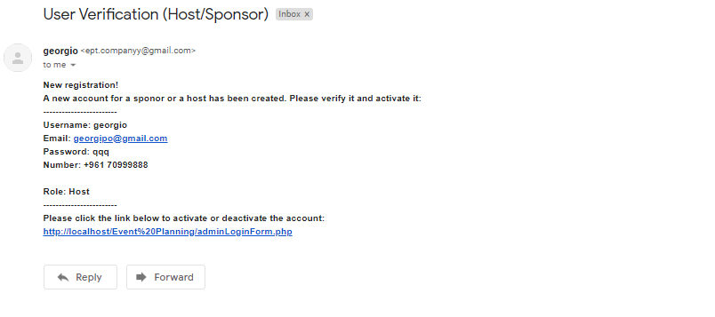
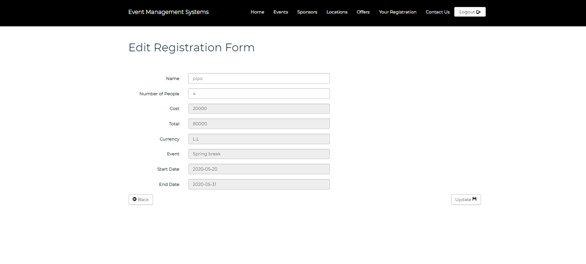

# Event-Planner
This is my senior project created for the Lebanese Canadian University-LCU in order to achieve the bachelor in computer science.
This website is for Event hosts to upload their event details such as pricing,location.. and for the sponsor to upload their offers and deals in order to be viewed by the event host. Then the guest, logs in to the website and views all the available events and registers to the event of his choice.

Home Page

Events

Locations

Contact

Registration Form

New Account Mail

View Unverified Users

Activate Account

Login Form

Events being held

Add Event

View Managers

Add Manager

Edit Manager

View Event Types

Add Event Types

Edit Event Types

View Locations

Add Event Types

Edit Event Types

View Sponsors

Add Sponsors

Edit Sponsors

View Offers

Add Offers

Edit Offers

View Currencies

Add Currency

Edit Currency

View Registration

Edit Registration

Bill Registration

Billing Mail

